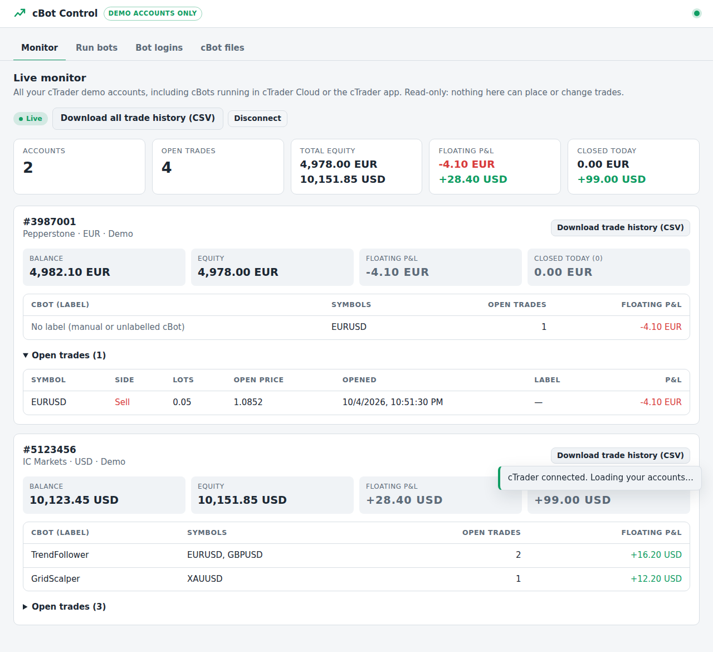
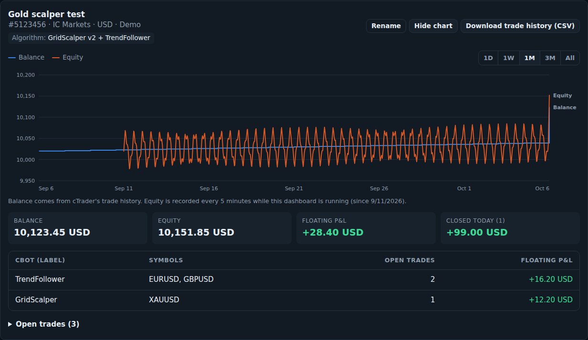

# cBot Control — watch and run cTrader cBots across many demo accounts



A web dashboard with two parts:

**Monitor (read-only)** — connects to your cTrader ID and shows every demo account live:
balance, equity, floating and today's profit/loss, and open trades grouped by cBot.
It sees cBots running anywhere: **cTrader Cloud**, the cTrader app, or this dashboard.
Download any account's **full trade history as a CSV** file (opens in Excel / Google Sheets).

**Run bots (optional)** — start cBots from the dashboard itself:

1. **Add your cTrader demo accounts** (cTrader ID login + demo account number).
2. **Upload your cBots** (the compiled `.algo` files).
3. **Create "bots"** — one cBot on one account, symbol and timeframe, with optional parameters.
4. **Start, stop and restart** them individually or all at once, watch **live logs**, and let crashed bots **restart automatically**.

Bots keep running even if you close the browser. Under the hood each bot runs in
Spotware's official [cTrader CLI Docker image](https://github.com/spotware/ctrader-console-docker),
the supported way to run cBots without the cTrader desktop app.

> **Demo accounts only.** The dashboard refuses to save an account unless you tick
> "this is a demo account". cTrader does not tell outside tools whether an account is
> demo or live, so it is up to you to only enter **demo** account numbers.

---

## Quick start (no typing needed)

1. **Download** this folder:
   [download ZIP](https://github.com/chrischrisjnr/ctrader-dashboard/archive/refs/heads/main.zip),
   and unzip it.
2. **Install Node.js**: <https://nodejs.org> → the big "LTS" button → install with all default options.
3. **Double-click** `Start (Windows).bat` or `Start (Mac).command`.
   - Windows may say "Windows protected your PC": click *More info* → *Run anyway*.
   - Mac may say it's from an unidentified developer: right-click the file → *Open* → *Open*.
4. Your browser opens the dashboard. Keep the black window open while bots run.

Without Docker you'll see a yellow **Simulation mode** banner: bots only print practice
lines and never touch cTrader. That's a safe way to learn the dashboard.

## Set up the Monitor

The dashboard opens on the **Monitor** tab, which walks you through these steps:

1. Go to <https://openapi.ctrader.com/apps>, log in with your cTrader ID and click **Add new app**.
   Add the **Redirect URI** the Monitor tab shows you (normally `http://127.0.0.1:3000/oauth/callback`).
   cTrader reviews new apps before they work; wait until yours shows as **Active** (can take a day).
2. Click **Credentials** next to the app and paste the **Client ID** and **Secret** into the Monitor tab. Click **Save**.
3. Click **Connect cTrader**, log in, and allow access. You're sent back to the dashboard and your accounts appear.

**Several cTrader IDs?** Register the Open API app **once**. Then, on the Monitor tab, use
**+ Add another cTrader login** for each extra cTrader ID. Log out at <https://id.ctrader.com> first,
otherwise cTrader reuses the login you're already signed in with. If all your accounts are under one
cTrader ID, just tick them all on cTrader's "Allow access" page.

The Monitor only asks cTrader for **read-only** access: it can't place, change or close trades.
Only **demo** accounts are shown. "cBot (label)" is the label your cBot puts on its trades; trades without
a label are grouped as "No label".

**Name your accounts:** click **Name it** on an account to give it your own name and note which
algorithm runs on it. Names are only stored in the dashboard (`DATA_DIR/account-names.json`) and
appear in the CSV downloads too.

**Balance & equity chart:** click **Chart** on an account. Choose 1D, 1W, 1M, 3M or All, and hover
(or use the arrow keys) to read exact values.
- *Balance* goes back to the day the account was opened: cTrader records the balance after every closed trade.
- *Equity* (balance + open trades) is not stored by cTrader, so the dashboard records it every
  5 minutes **while it is running**. Its line starts the first time you run this version and grows from there.



**Trade history CSV** columns: account, account name, algorithm, time (UTC), deal/position/order IDs, symbol, buy/sell, open/close,
lots, units, price, entry price, gross profit, swap, commission, net profit, balance after, cBot label, comment.
Large histories can take a minute to prepare.

## Run real cBots from the dashboard (optional)

You don't need this if your cBots already run in cTrader Cloud. **Never run the same cBot on the same
account and symbol in two places at once** — it would open double trades.

### Option A — on your own Windows or Mac computer

1. Install [Docker Desktop](https://www.docker.com/products/docker-desktop/), open it, and wait
   until it says it's running (it can ask you to restart your computer).
2. Close the dashboard's black window and double-click the Start file again.
3. The badge at the top should now say **cTrader CLI** instead of **Simulation**.

The first time a bot starts, Docker downloads the cTrader image (about 250 MB), so the
first start can take a few minutes. Bots stop when your computer sleeps or shuts down.

### Option B — 24/7 on a Linux server (VPS)

Best if bots should run around the clock. On a server with Docker installed:

```bash
git clone https://github.com/chrischrisjnr/ctrader-dashboard.git && cd ctrader-dashboard
cp .env.example .env
nano .env                  # set DASHBOARD_PASSWORD to a strong password
docker compose up -d --build
```

Open `http://YOUR-SERVER-IP:3000`. Data is stored in `/opt/ctrader-dashboard/data` on the server.
For use over the internet, put the dashboard behind HTTPS (for example
[Caddy](https://caddyserver.com/docs/quick-starts/reverse-proxy): `caddy reverse-proxy --from your.domain --to :3000`)
or only reach it through a VPN / SSH tunnel.

---

## Using the dashboard

**1. Add a demo account** (Accounts tab)

| Field | Where to find it |
|---|---|
| cTrader ID | The email/username you log into cTrader with |
| Password | Your cTrader ID password |
| Account number | In cTrader, the number shown next to your demo account (e.g. `5123456`) |

You can add as many accounts as you like, from the same or different cTrader IDs.

**2. Upload a cBot** (cBot files tab)

In cTrader → *Algo* → right-click your cBot → *Show in folder*. Upload the `.algo` file.
Build the cBot in cTrader first so the file is up to date.

**3. Create a bot** (Bots tab → *+ New bot*)

Pick the cBot, account, symbol (e.g. `EURUSD`) and timeframe. Under *cBot parameters*
you can override any parameter — the name must match the parameter's name in the cBot's
code exactly (e.g. `StopLossPips`). Anything you leave out uses the cBot's default.

Tick *full access* only if your cBot was written with `AccessRights = AccessRights.FullAccess`.

**4. Press Start.** Click *Logs* to see what the cBot prints in real time.

### What the statuses mean

| Status | Meaning |
|---|---|
| Starting / Stopping | Working on it |
| Running | The cBot is running on the account |
| Restarting | It crashed and will be restarted automatically shortly |
| Stopped | Not running (you stopped it, or the cBot stopped itself) |
| Problem | It failed to start or kept crashing — open *Logs* to see why |

A crashing bot is restarted up to 5 times in 10 minutes, waiting longer each time, then marked *Problem*.
If the dashboard itself restarts, it reconnects to bots that are still running and restarts any that should be.

---

## Settings (`.env` file)

| Setting | Default | What it does |
|---|---|---|
| `DASHBOARD_PASSWORD` | *(none)* | Login password. Required if `HOST` isn't `127.0.0.1`. |
| `HOST` | `127.0.0.1` | `127.0.0.1` = only this computer can open the dashboard. `0.0.0.0` = other devices too. |
| `PORT` | `3000` | Web port. |
| `RUNNER` | `auto` | `auto`, `docker` (real cBots) or `simulation` (practice only). |
| `DATA_DIR` | `./data` | Where accounts, cBot files and passwords are stored. |
| `CTRADER_IMAGE` | `ghcr.io/spotware/ctrader-console:latest` | cTrader CLI image version. |

## Security notes

- cTrader passwords are stored as files in `DATA_DIR/secrets` (folder readable only by the
  dashboard's user) because the cTrader CLI reads the password from a file. They are never
  sent back to the browser. Keep `DATA_DIR` private and backed up.
- The dashboard controls Docker, which is powerful: only share the dashboard password with people you trust.

## Troubleshooting

- **"Could not start" / bot goes to Problem right away** — open *Logs*. Common causes: wrong
  cTrader ID password, the account number doesn't belong to that cTrader ID, or a misspelled parameter name.
- **Badge says Simulation but you want real bots** — make sure Docker Desktop is running, then restart the dashboard.
- **First start is slow** — Docker is downloading the cTrader image; later starts are quick.

## For developers

```
server/
  index.js           app startup, security headers, runner selection
  monitor.js         read-only live account monitor (cTrader Open API)
  history.js         full trade history download -> CSV
  equity.js          balance & equity curves (cTrader deal history + recorded equity samples)
  ctrader/           Open API JSON/WebSocket client and OAuth helpers
  config.js          settings from environment / .env
  routes.js          REST API + live updates (Server-Sent Events)
  manager.js         bot lifecycle: start/stop, logs, crash detection, auto-restart
  runners/docker.js  runs cBots via the cTrader CLI Docker image
  runners/simulation.js  fake runner for practice mode
  store.js           JSON-file storage with atomic writes
  validation.js      input checks (incl. demo-only rule)
  auth.js            password login + sessions
public/              dashboard UI (plain HTML/CSS/JS, no build step)
test/                tests (incl. a fake cTrader server): `npm test`
```
